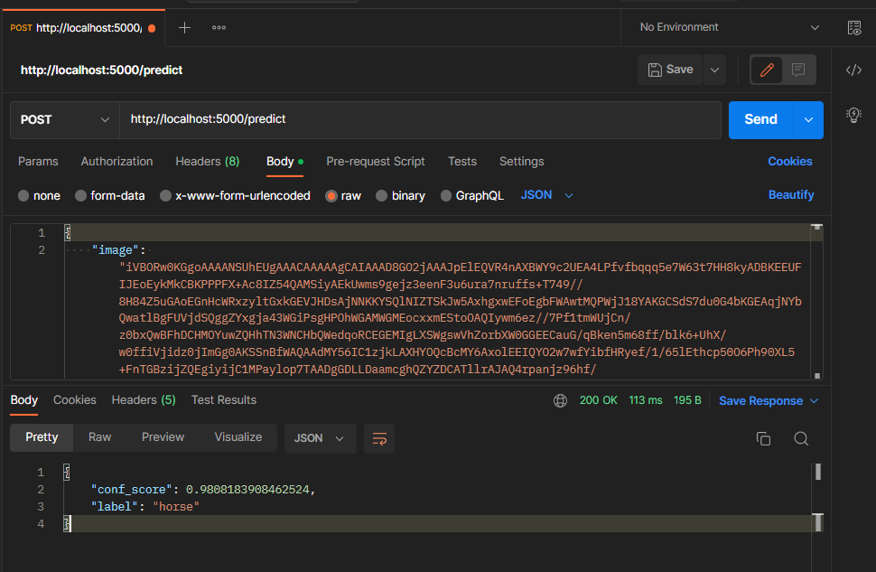
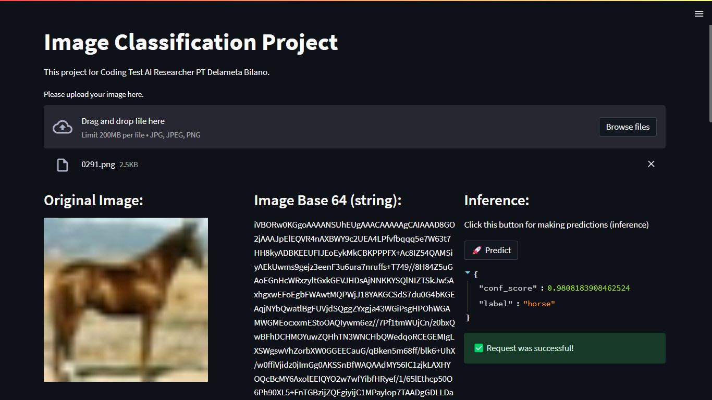

# Deployment-Phase

## Preview

   
   

## How to Run
1. clone this repo and go to deployment-phase directory: cd deployment-phase
2. Firstly, pull docker container for postgres sql: docker pull postgres
3. Then, run postgres docker container: docker run --name postgres -e POSTGRES_USER=postgres -e POSTGRES_PASSWORD=password -e POSTGRES_DB=postgres -p 5432:5432 -d postgres
4. Build docker compose using this command: docker-compose build
5. Run this command to running docker compose: docker-compose up
6. You can use postman app to try API service (see in figure above).
7. To use interface for app, you can go to streamlit dir: cd streamlit and then run this command: streamlit run app.py (Make sure API service is running).
